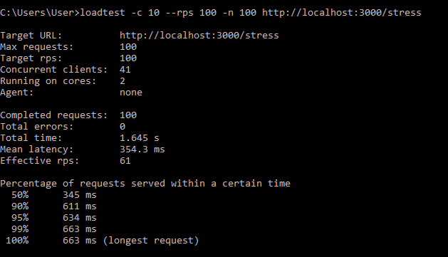
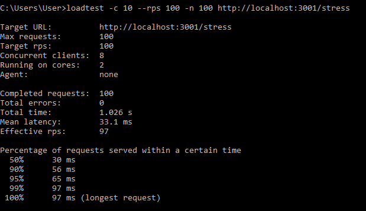

### Cluster
#### Clusters of Node.js processes can be used to run multiple instances of Node.js that can distribute workloads among their application threads. When process isolation is not needed, use the worker_threads module instead, which allows running multiple application threads within a single Node.js instance.

### Step to run
>$ npm run app
>
>$ loadtest -c 10 --rps 100 -n 100 http://localhost:3000/stress

>$ npm run app:cluster
>
>$ loadtest -c 10 --rps 100 -n 100 http://localhost:3001/stress

# Performance Comparison of Two Stress Tests

## Test Setup And Result
**Test 1:**

**Test 2:**

<!-- - **Test 1:**
  - **URL:** `http://localhost:3000/stress`
  - **Max requests:** 100
  - **Target requests per second (rps):** 100
  - **Concurrent clients:** 41
  - **Cores:** 2

- **Test 2:**
  - **URL:** `http://localhost:3001/stress`
  - **Max requests:** 100
  - **Target requests per second (rps):** 100
  - **Concurrent clients:** 8
  - **Cores:** 2

## Results

### Test 1
- **Completed requests:** 100
- **Total errors:** 0
- **Total time:** 1.645 s
- **Mean latency:** 354.3 ms
- **Effective rps:** 61
- **Latency distribution:**
  - 50% of requests served within: 345 ms
  - 90% of requests served within: 611 ms
  - 95% of requests served within: 634 ms
  - 99% of requests served within: 663 ms
  - Longest request time: 663 ms

### Test 2
- **Completed requests:** 100
- **Total errors:** 0
- **Total time:** 1.026 s
- **Mean latency:** 33.1 ms
- **Effective rps:** 97
- **Latency distribution:**
  - 50% of requests served within: 30 ms
  - 90% of requests served within: 56 ms
  - 95% of requests served within: 65 ms
  - 99% of requests served within: 97 ms
  - Longest request time: 97 ms -->

## Analysis

### Total Time and Effective RPS
- **Test 1:** Took 1.645 seconds to complete 100 requests, with an effective throughput of 61 requests per second.
- **Test 2:** Took 1.026 seconds to complete 100 requests, with an effective throughput of 97 requests per second.
- **Conclusion:** Test 2 is more efficient in terms of throughput.

### Mean Latency
- **Test 1:** Mean latency was 354.3 ms.
- **Test 2:** Mean latency was significantly lower at 33.1 ms.
- **Conclusion:** Test 2 has a much lower average response time.

### Latency Distribution
- **Test 1:**
  - 50% of requests served within 345 ms.
  - 90% within 611 ms.
  - 95% within 634 ms.
  - 99% within 663 ms.
  - Longest request took 663 ms.
- **Test 2:**
  - 50% of requests served within 30 ms.
  - 90% within 56 ms.
  - 95% within 65 ms.
  - 99% within 97 ms.
  - Longest request took 97 ms.
- **Conclusion:** Test 2 shows significantly better performance across all percentiles, indicating more consistent and faster response times.

### Concurrency and Performance
- **Test 1:** Utilized 41 concurrent clients.
- **Test 2:** Utilized only 8 concurrent clients.
- **Conclusion:** Despite fewer concurrent clients, Test 2 performed better, suggesting it handles load more efficiently.

## Conclusion
- **Throughput:** Test 2 (`http://localhost:3001/stress`) demonstrated higher throughput with 97 effective requests per second compared to Test 1's 61 rps.
- **Latency:** Test 2 had significantly lower mean latency (33.1 ms vs. 354.3 ms) and better latency distribution across all percentiles.
- **Concurrency Efficiency:** Test 2 achieved better performance with fewer concurrent clients.

Test 2 is more efficient in terms of both throughput and response time, making it the preferable configuration for handling stress under the given test conditions.
